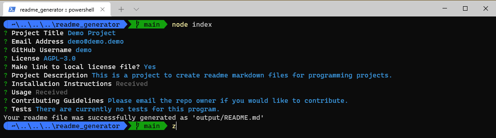
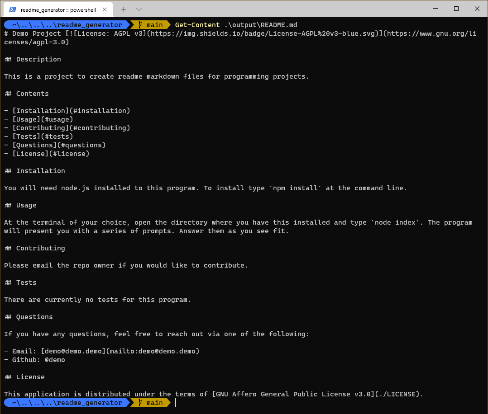
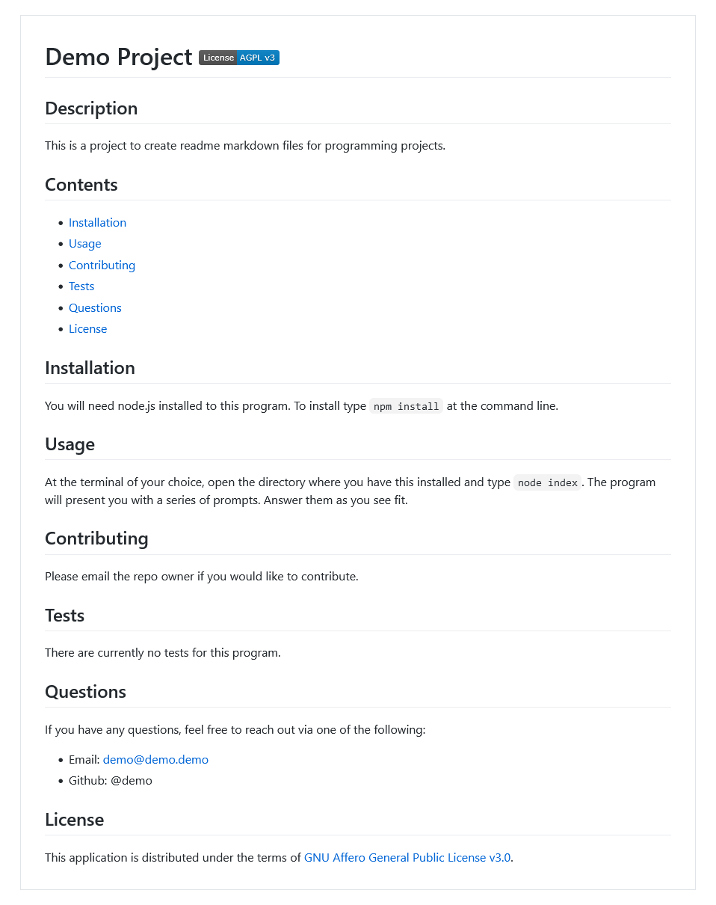

# Readme Generator 

## Description

This is a CLI-based generator of markdown README files for programming projects. It is implemented in node.js.

## Contents

- [Installation](#installation)
- [Usage](#usage)
- [Contributing](#contributing)
- [Questions](#questions)
- [License](#license)

## Installation

This program requires node.js to use. To install, open the terminal in the directory where you want to install the program and type `npm install https://github.com/baker-ling/readme_generator`.

## Usage

In a terminal open to the directory where you installed the program, type: `node index`.

The program will present you with a series of questions for information to include in your readme. See the screenshot below to get an idea.

The program will create at `output/README.md` (relative to the program).

A few of the questions merit additional explanation:

1. After picking a license, the program will as you if you want to link to a local license file or not. Answer yes to create a link to the file `LICENSE` in the same folder where you will put the `README.md` file generated. Answer no to create a link to the license file elsewhere on the internet (e.g. gnu.org or opensource.org).

2. The installation instructions and usage instructions questions will prompt for you to type into your system's text editor. Just press <kbd>Enter</kbd> as prompted, and the text editor will open. Type in your response and save when done.

3. Email, GitHub Username, Contributing Guidelines, and Tests questions are optional. Leave these blank if you want to leave them out of your README file.

Example output from input in screenshot above:

Example output rendered in the browser:

## Contributing

Please contact the owner of this repo if you are interested in contributing.

## Questions

If you have any questions, feel free to reach out via one of the following:

- Email: [brian.devs.baker@gmail.com](mailto:brian.devs.baker@gmail.com)
- Github: @baker-ling

## License

This application is distributed under the terms of [GNU Affero General Public License v3.0](./LICENSE).
